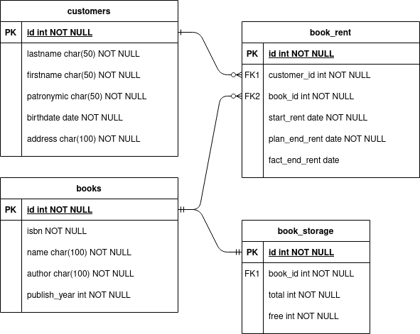

##Описание модели базы данных
###ER-модель

###Описание
* Сущность **customers** является справочником и состоит из набора полей:
    * id - идентификатор клиента (или номер читательского билета например)
    * lastname - фамилия
    * firstname - имя
    * patronymic - отчество
    * birthdate - дата рождения
    * address - адрес проживания
* Сущность **books** является справочником и состоит из набора полей:
  * id - идентификатор книги (внутренний идентификатор)
  * isbn - международный стандартный книжный номер (состоящий из 13 цифр)
  * title - название книги
  * author - автор книги
  * publish_year - год издания
* Сущность **book_storage** служит для отслеживания общего и остаточного числа книг, состоит из набора полей:
  * id - идентификатор хранилища (можно было бы обойтись без этого поля, но лучше всегда добавлять идентификаторы записей)
  * book_id - идентификатор книги (связан one-to-one к сущности **books**)
  * total - общее количество экземпляров книги
  * free - остаточное количество экземпляров книги
* Сущность **book_rent** служит для отслеживания факта взятия/изъятия книги в/из аренды, состоит из набора полей:
  * id - идентификатор операции
  * customer_id - идентификатор клиента (связан many-to-one к сущности **customers**)
  * book_id - идентификатор книги (связан many-to-one к сущности **books**)
  * start_rent - дата начала аренды
  * plan_end_rent - плановая дата окончания аренды
  * fact_end_rent - фактическая дата окончания аренды